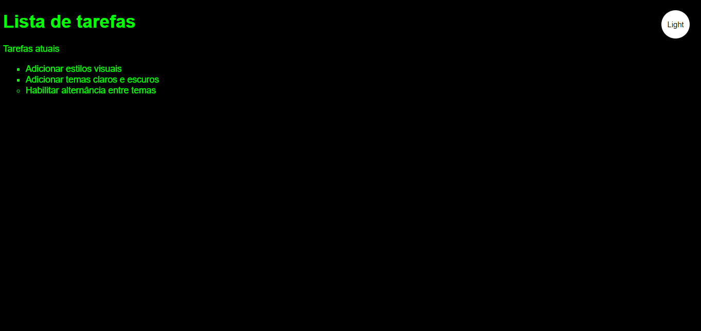
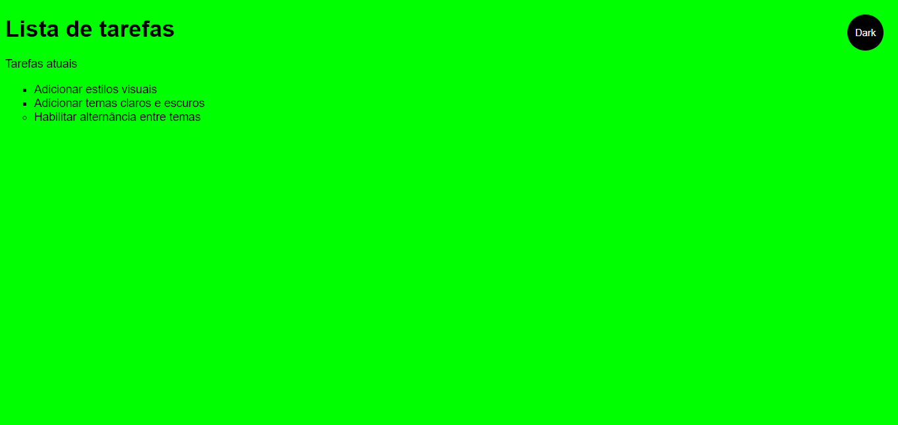
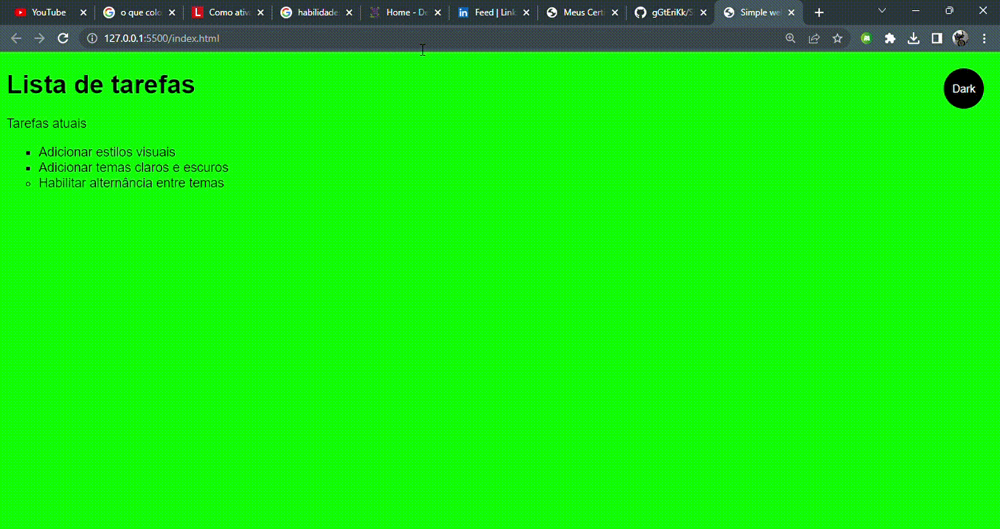

# Site Simples

## Descrição:

    Este projeto foi feito durante um mini curso da Escola do Trabalhador 4.0 e nele foram utilizados HTML, CSS e JavaScript. Consiste em uma página, onde tem uma lista e um botão e as cores de fundo alternam entre os temas claro e escuro no clique deste botão. Ao fim do curso, foi adquirido um certificado, agregando muito na minha jornada.

> Resultado do projeto:

## 💻 Tecnologias utilizadas:

## 🔗🎓 Link do certificado:

<a href="https://ead.escoladotrabalhador40.com.br/storage/certificates/Certificate_114102_36_rm72x.pdf?sv=2019-07-07&sr=b&sig=Mib2H7dH9PebvOasHQP3R2YIQ7J0c97t5IAiz8KdKgo%3D&se=2024-06-12T00%3A44%3A35Z&sp=r">Clique aqui</a>

## Desenvolvedor:

<table>
  <tr>
    <td align="center">
      <a href="https://github.com/gGtEriKk">
         
        
          <b>Erik Gomes</b>
        
      </a>    
</table>